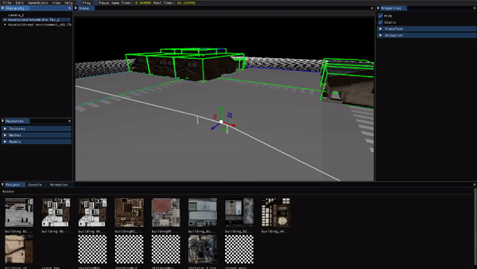
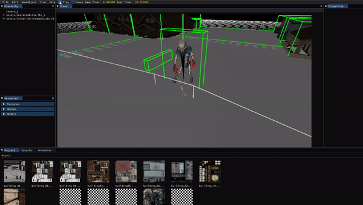

Engine is a 3D game engine developed by two students from CITM-UPC Terrassa, Alejandro París and Cere Venteo.

- Alejandro GitHub account: [Alejandro París](https://github.com/AlejandroParis)
- Cere GitHub account: [Cere Venteo](https://github.com/CereVenteo)
- Our GitHub organization: [Beautiful Engine](https://github.com/Beautiful-Engines)
- GitHub repository: [Engine](https://github.com/Beautiful-Engines/Engine)
- Last Realase: [Here](https://github.com/Beautiful-Engines/Engine/releases)

## The Team

- [Alejandro París](https://github.com/AlejandroParis) - Design and Code<br>
<br>
- [Cere Venteo](https://github.com/CereVenteo) - Design and Code<br>
<br>

## The Engine

#### Game Objects
- Drag from Project panel creates a new GameObject.
- Select GameObjects clicking on the scene or the hierarchy.
- All GameObjects of the scene appear at Hierarchy with inheritance structure.
- Activate/Deactivate and make static Game Object on Inspector.

#### Debug
- Component Mesh on Inspector can activate and deactivate vertex normals and face normals
- Component Texture on Inspector can activate and deactivate Checkers texture for the Mesh
- Console window logs
- Objects with Bounding Box, can activate and deactivate at Edit->Bounding Box
- Quadtree, can activate and deactivate at Edit->Quadtree

#### Camera
- Modify the different camera values (FOV,near and far plane, frustrum culling)​​in the inspector menu.

#### Play/Pause
- Engine can Start / Pause clicking on the checkbox.
- Check the game clock and the real time clock next to the checkboxs.
- For stop playmode take out the checkbox and recover the original state before play.

#### Resource Manager
- The Project panel show everything on the assets folder.
- The Resources panel show everything loaded in the engine ordered by type.
- Dragging a new model or texture to the menu project will create its corresponding files the meta, the .axf for meshes, .xfa for models and .dds for textures.
- At the Resource panel we can see how many objects in the scene are using that resource

**IMPORTANT: To import things to the assets folder it is recommended to drag them to the engine.

#### Scene Serialization
- Save the current scene or load a scene from Menu->File->Save/Load.

#### Render Mode

In this menu you can enable and disable:
	- Depth
	- Cull Face
	- Lightning
	- Color
	- Textures
	- Bounding Box
	- Quadtree
	- Normals
	- Wireframe	
	
If something is not working as expected, please, revise console panel to understand what is happening.
If, after that, you assume the engine is running an error, revise issues or send a new one (we would be very grateful).

### Skeletal Animation

The importing of animations is done with Assimp, from fbx and dae files.
When creating meshes, it reads the bones that it is using and create the corresponding bone resource. It then reads all the animations of the scene and creates the animation resources, storing the corresponding transformations over time of the bones (linked by name).
When assigning a resource to a component animation, it looks for the used bones inside the gameObjects hierarchy and find them by the name.
On the Update, it loops through all the bones and apply the corresponding transformation to the gameObjects, calculating interpolations if activated, as well as animation blending when changing them.
To do the interpolation, it basically does a Lerp operation of the current frame and the next frame based on the percentage of time elapsed. For animation blending, it temporally keeps the new resource that will be assigned and do interpolation between the frame of the current animation and the first frame of the next animation before finally swaping the animations.
Before the render of the mesh, it calculates a morphed version of it, adapting to the linked bones and rendering it instead of the original one.

#### Editor
<br>

####In-Game
<br>

### Controls

#### Camera
- ESC: Quit Engine
- Mouse Hold Right:
	- WASD: move forward, left, backward and right
	- Look around
- F: look at target
- Hold Alt:
	- Mouse Hold Left: look around target
- Mouse Wheel: zoom in/out
- Mouse Hold Shift: movement speed x2, zoom speed x2
- Hold 2: animation run
- 1: attack

#### Shortcuts
- LCTRL + S: Save scene
- LCTRL + L: Load scene

### Delivery List by Members
- Transformations following hierarchy - Alejandro París
- Inspector show properties - Alejandro París, Cere Venteo
- Pick GameObjects from the world - Alejandro París
- Static GameObjects accelerated using a quadtree - Alejandro París, Cere Venteo
- FOV - Alejandro París
- Scene window resized to the new aspect ratio - Alejandro París
- AABB and Frustrum Culling - Alejandro París
- Scene serialized to a file - Cere Venteo
- Models, Meshes and Textures saved to our own format - Cere Venteo
- Start / Pause / Stop - Alejandro París
- Resources with reference counting visualized in Resources Window - Cere Venteo
- Resources Managment - Cere Venteo
- Skeletal Animation - Alejandro París, Cere Venteo
- Skinning - Cere Venteo

### Game Video

<iframe width="427" height="240" src="https://www.youtube.com/embed/DQ_xzqllJkY" frameborder="0" allow="autoplay; encrypted-media" allowfullscreen></iframe>

## License

```
MIT License

Copyright (c) 2019 Alejandro París and Cere Venteo

Permission is hereby granted, free of charge, to any person obtaining a copy
of this software and associated documentation files (the "Software"), to deal
in the Software without restriction, including without limitation the rights
to use, copy, modify, merge, publish, distribute, sublicense, and/or sell
copies of the Software, and to permit persons to whom the Software is
furnished to do so, subject to the following conditions:

The above copyright notice and this permission notice shall be included in all
copies or substantial portions of the Software.

THE SOFTWARE IS PROVIDED "AS IS", WITHOUT WARRANTY OF ANY KIND, EXPRESS OR
IMPLIED, INCLUDING BUT NOT LIMITED TO THE WARRANTIES OF MERCHANTABILITY,
FITNESS FOR A PARTICULAR PURPOSE AND NONINFRINGEMENT. IN NO EVENT SHALL THE
AUTHORS OR COPYRIGHT HOLDERS BE LIABLE FOR ANY CLAIM, DAMAGES OR OTHER
LIABILITY, WHETHER IN AN ACTION OF CONTRACT, TORT OR OTHERWISE, ARISING FROM,
OUT OF OR IN CONNECTION WITH THE SOFTWARE OR THE USE OR OTHER DEALINGS IN THE
SOFTWARE.
```

